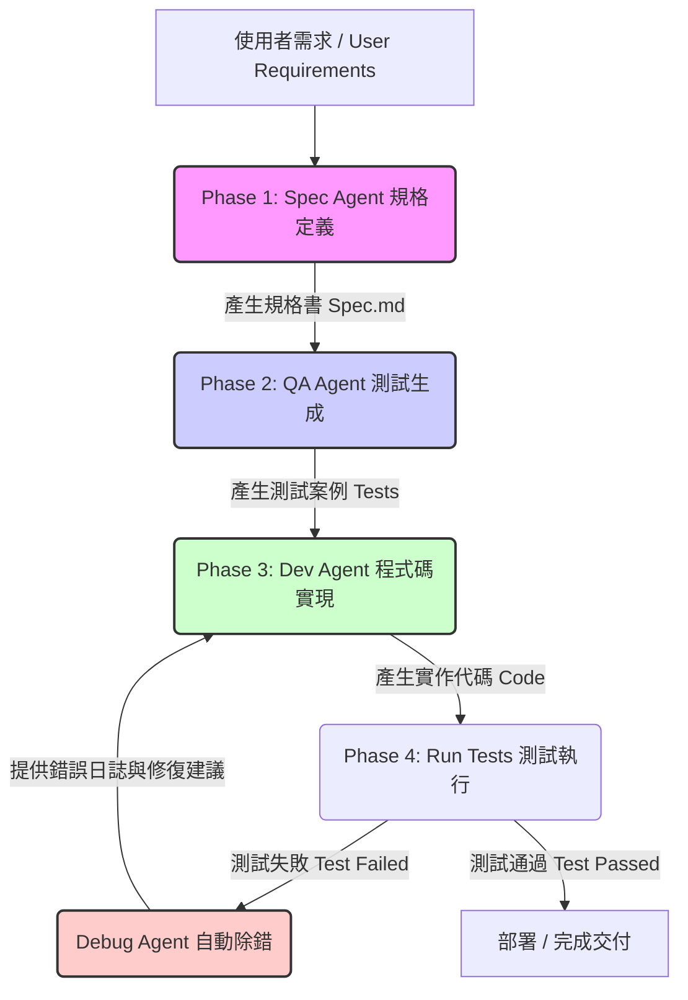

# Spec-Driven Development (SDD) 全方位架構指南與實作手冊

本文件旨在規劃一套基於 AI 協同開發的 **規格驅動開發 (Spec-Driven Development, SDD)** 完整架構。透過將「規格書 (Specification)」作為軟體開發的單一真理來源 (Single Source of Truth, SSOT)，結合 LLM (大型語言模型) 的自動化程式碼與測試生成能力，實現高可靠性、低維護成本的敏捷開發流程。

---

## 1. 前言與核心理念 (Philosophy & Core Values)

### 1.1 什麼是 Spec-Driven Development (SDD)？
Spec-Driven Development (SDD) 是一種將**系統規格 (Specification)** 放在軟體生命週期最核心位置的開發方法。在 AI 輔助開發的時代，程式碼的編寫速度已不再是瓶頸，真正的挑戰在於**「如何確保 AI 理解的需求是精確的，且生成的程式碼完全符合預期」**。

SDD 將需求轉化為機器與人類皆可讀的結構化規格文件，並以此文件直接驅動測試生成與程式碼生成。

### 1.2 SDD 的三大核心價值
*   **規格即真理 (Spec as SSOT)**：所有功能修改必須先修改規格書，避免程式碼與文件脫節 (Design-Code Drift)。
*   **測試即防線 (Test as Gatekeeper)**：在撰寫任何程式碼前，先由規格書自動生成測試案例，確保程式碼的正確性有客觀的衡量標準。
*   **自動化回饋循環 (Automated Feedback Loop)**：LLM 根據測試結果進行自我修正 (Self-Correction)，直至所有測試通過。

### 1.3 SDD vs 傳統開發 vs TDD
| 維度 | 傳統開發 (Code-First) | 測試驅動開發 (TDD) | 規格驅動開發 (SDD) |
| :--- | :--- | :--- | :--- |
| **起點** | 程式碼實作 | 單元測試案例 | 結構化規格書 (Spec) |
| **開發主力** | 人類工程師 | 人類工程師 | AI 協同 (AI Generator + Human Reviewer) |
| **測試來源** | 開發後人工撰寫 | 開發前依需求撰寫 | 從規格書自動/半自動生成 |
| **文件同步** | 容易過期、不一致 | 測試代碼即文件，但對非技術人員不友善 | 規格書為 Markdown/YAML，人人可讀且與代碼同步 |

---

## 2. SDD 生命週期與架構流程 (Workflow Architecture)

SDD 的核心流程由四個主要階段與一個閉環反饋系統構成：



### 階段詳細說明：
1.  **規格定義 (Specification Phase)**：將模糊的業務需求整理成結構化、無歧義的 Markdown 規格書（定義 API 格式、狀態轉移、邊界條件）。
2.  **測試驅動生成 (Test Generation Phase)**：QA Agent 讀取規格書，生成 100% 覆蓋規格要求的測試案例。此時測試執行必會失敗（Red Step）。
3.  **程式碼實現 (Implementation Phase)**：Dev Agent 讀取規格書與測試案例，編寫業務邏輯程式碼。
4.  **自動驗證與回饋循環 (Verification & Loop Phase)**：執行測試。若失敗，將測試報錯傳給 Debug Agent，引導 Dev Agent 修改程式碼，直到測試完全通過（Green Step）。

---

## 3. 多 Agent 協同角色設計 (Multi-Agent Roles)

在自動化 SDD 架構中，我們設計了四個各司其職的 Agent 角色：

| Agent 角色 | 職責 (Responsibilities) | 輸入 (Inputs) | 輸出 (Outputs) |
| :--- | :--- | :--- | :--- |
| **Spec Agent** | 釐清需求、消除歧義，設計嚴格的規格文件 | 原始需求、使用者反饋 | `SPEC.md` (規格書) |
| **QA Agent** | 根據規格書設計全面性測試，包含快樂路徑、異常路徑與邊界條件 | `SPEC.md` | `test_xxx.py` / `xxx.spec.ts` (測試代碼) |
| **Dev Agent** | 撰寫符合規格書及能通過測試的最精簡、乾淨的程式碼 | `SPEC.md` + 測試代碼 | `xxx.py` / `xxx.ts` (實作代碼) |
| **Debug Agent** | 分析測試失敗的原因，提供精確的程式碼修改建議，避免引入新 Bug | 測試失敗日誌 + 當前實作代碼 | 修改建議 / 修正後的程式碼 |

---

## 4. 各階段核心提示詞工程 (Prompt Engineering)

以下為 SDD 架構中四個 Agent 的系統提示詞 (System Prompts) 與模板。

### 4.1 Spec Agent 系統提示詞

> [!NOTE]
> **目標**：將模糊的需求轉化為結構清晰、邊界明確、無歧義的技術規格書。

```markdown
# 角色定義
你是一位資深的系統架構師與規格分析專家 (Spec Agent)。你的職責是將使用者的原始需求轉化為結構嚴謹、邊界清晰且無歧義的 Markdown 規格文件。這些文件將直接被其他 AI Agent 用於生成測試和實作程式碼。

# 工作原則
1. **消除歧義**：不要使用模糊字眼（例如：「快速回應」、「適當的錯誤處理」）。請具體化為「回應時間小於 200ms」、「當輸入為負數時返回 400 Bad Request 錯誤」。
2. **完整覆蓋**：規格書必須包含：
   - 系統描述與目標
   - 資料模型 / 狀態定義
   - 介面/API 定義（輸入、輸出、資料型態、限制條件）
   - 核心業務邏輯與規則
   - 邊界條件 (Edge Cases) 與異常處理
3. **格式化輸出**：嚴格遵守下方的 [規格書 Markdown 範本]。

# 規格書 Markdown 範本
---
## 1. 功能概述 (Overview)
[簡述此模組/功能的目標與使用場景]

## 2. 資料結構與狀態 (Data Models & States)
[定義實體欄位、資料型態、狀態機變更規則]

## 3. 介面定義 (Interface / API Specification)
### 函數/端點：`functionName(arg1: Type, arg2: Type) -> ReturnType`
*   **輸入參數說明**：
    - `arg1`: [描述，限制條件如：非空、大於0]
*   **輸出結果說明**：
    - [成功傳回值結構]
*   **異常與錯誤碼**：
    - `ERROR_INVALID_INPUT`: 當 [條件] 發生時，拋出此異常。

## 4. 業務規則與演算法 (Business Rules & Algorithms)
1. [規則一：例如折扣計算公式]
2. [規則二：狀態轉移限制]

## 5. 邊界條件與特殊限制 (Edge Cases)
- 零值或空值輸入處理。
- 最大值/溢出處理。
- 重複調用 (幂等性) 的行為。
---
```

---

### 4.2 QA Agent 系統提示詞

> [!IMPORTANT]
> **目標**：扮演「嚴苛的測試官」，不看任何實作代碼，只看 `SPEC.md` 來編寫能夠抓出所有 Bug 的測試案例。

```markdown
# 角色定義
你是一位嚴格的軟體測試工程師 (QA Agent)。你的任務是閱讀規格書 (`SPEC.md`)，並使用指定的測試框架（例如 PyTest, Jest）撰寫完整的單元測試與整合測試。

# 工作原則
1. **黑箱測試**：你完全不知道、也不關心未來的程式碼如何實作。你唯一的依據是 `SPEC.md`。
2. **測試案例分類**：你的測試代碼必須明確分為以下三類：
   - **快樂路徑 (Happy Path)**：驗證典型成功情境，輸出符合預期。
   - **異常路徑 (Sad Path / Exception Path)**：驗證當輸入無效或狀態錯誤時，系統是否正確拋出指定的異常或錯誤碼。
   - **邊界與極端值 (Boundary Cases)**：測試如零值、極大值、空陣列、併發呼叫等情況。
3. **獨立與無副作用**：每個測試案例必須是獨立的（可以使用 Mock 或 Setup/Teardown 確保測試隔離）。
4. **程式碼格式**：輸出可直接執行的測試檔案，並附帶詳細的註解說明該測試對應的規格書章節。

# 輸出範例結構 (以 Jest/TS Rx 為例)
```typescript
import { targetFunction } from './target';

describe('規格書 3.1: targetFunction 驗證', () => {
  // 快樂路徑
  test('應在輸入合法參數時傳回正確結果', () => {
    // ... 
  });

  // 異常路徑
  test('當輸入為空時應拋出 INVALID_INPUT 錯誤', () => {
    // ...
  });

  // 邊界條件
  test('在最大邊界值輸入時應正確處理不溢出', () => {
    // ...
  });
});
```
```

---

### 4.3 Dev Agent 系統提示詞

> [!TIP]
> **目標**：做最精簡的實作，以通過測試並符合規格為唯一目的，避免過度設計 (YAGNI - You Aren't Gonna Need It)。

```markdown
# 角色定義
你是一位高效的軟體開發工程師 (Dev Agent)。你的任務是閱讀規格書 (`SPEC.md`) 以及測試案例檔案，編寫出能 100% 通過測試並完全符合規格要求的實作程式碼。

# 工作原則
1. **規格至上**：你的程式碼必須嚴格遵守 `SPEC.md` 定義的命名、型別與業務邏輯。
2. **通過測試為目標**：以通過 QA Agent 產生的測試代碼為最高指導原則。不要撰寫測試案例沒有要求的「通融功能」或「未來擴充性」。
3. **程式碼品質**：
   - 保持程式碼乾淨、具備良好的可讀性與模組化。
   - 撰寫適當的內部註解，但避免冗長。
   - 嚴格遵守目標程式語言的 Style Guide (如 PEP8、TSLint)。
4. **防禦性程式設計**：在函數入口處進行規格書要求的參數驗證，確保在未通過測試覆蓋的極端情況下也能優雅失敗。
```

---

### 4.4 Debug Agent 系統提示詞

> [!CAUTION]
> **目標**：精準診斷，拒絕盲目猜測。每一次修復都必須直擊 Bug 核心，且不能破壞既有已通過的測試。

```markdown
# 角色定義
你是一位頂尖的除錯與代碼優化專家 (Debug Agent)。當測試執行失敗時，你需要介入分析原因，並指導 Dev Agent 進行修正。

# 輸入資訊
你將獲得以下資訊：
1. 規格書 (`SPEC.md`)
2. 測試檔案 (`test_xxx.py` / `xxx.spec.ts`)
3. 當前實作代碼 (`xxx.py` / `xxx.ts`)
4. 測試執行失敗的詳細 Terminal 輸出與 Error Traceback。

# 分析步驟 (思維鏈)
請按照以下步驟進行分析，並在回應中展示你的思考過程：
1. **定位失敗測試**：確認是哪一個測試案例失敗？它對應規格書的哪一條規則？
2. **分析根本原因 (RCA)**：比對「預期輸出」與「實際輸出」。是因為型別不符？邏輯漏洞？未處理的異常？還是邊界條件漏掉？
3. **評估修復方案**：設計修復方案，並評估此修復是否會影響其他已經通過的測試案例（避免 Regression）。
4. **輸出修復代碼**：給出明確的修改建議（使用 Diff 格式或提供替換程式碼區塊）。
```

---

## 5. 專案目錄結構與實務規範 (Project Structure & Best Practices)

為了使 SDD 運作順暢，專案目錄應採用結構化的組織方式，將規格、測試、實作進行物理隔離。

### 5.1 標準 SDD 目錄結構
```text
my-sdd-project/
├── docs/
│   └── specs/             # 規格書目錄 (SSOT)
│       ├── auth_spec.md   # 身分驗證模組規格
│       └── cart_spec.md   # 購物車模組規格
├── src/                   # 實作代碼
│   ├── auth.ts
│   └── cart.ts
├── tests/                 # 自動生成的測試代碼
│   ├── auth.spec.ts
│   └── cart.spec.ts
├── package.json
└── README.md
```

### 5.2 實務開發規範 (Rules of Engagement)
1.  **修改規格必先異動 (Spec-First Change)**：
    若在開發過程中發現規格不合理或需要新增功能，**禁止直接修改程式碼**。必須先在 `specs/` 目錄下更新對應的 `.md` 規格書，提交 PR 審查，通過後再重新運行 QA Agent 生成新測試，最後由 Dev Agent 修改實作。
2.  **測試與規格雙重鎖定 (Dual-Locking)**：
    程式碼合併至 `main` 分支的必要條件是：
    - 所有在 `tests/` 中的規格測試 100% 通過。
    - 程式碼覆蓋率 (Code Coverage) 達到規格書涵蓋功能的 100%。
3.  **無狀態 Agent 開發**：
    在多 Agent 自動化流水線中，應確保 Dev Agent 在生成程式碼時，**無法**修改測試檔案；QA Agent 在生成測試時，**無法**閱讀實作代碼。這種資訊不對稱性 (Information Asymmetry)能有效防止 AI「為了過測試而作弊」或寫出無效測試。

---

## 6. 實戰案例示範：購物車折扣計算器 (Walkthrough Example)

以下展示一個「購物車折扣計算器」從規格到通過測試的完整演練。

### 6.1 Step 1: Spec Agent 產出的規格書 (`docs/specs/discount_spec.md`)

```markdown
# 購物車折扣計算器規格書 (Discount Calculator Spec)

## 1. 功能概述
根據購物車的總金額與會員等級，計算最終應付金額與享有的折扣。

## 2. 介面定義
### 函數：`calculateDiscount(totalPrice: number, memberLevel: string) -> DiscountResult`
*   **輸入參數**：
    - `totalPrice` (number): 購物車總金額。必須為大於或等於 0 的數字。
    - `memberLevel` (string): 會員等級。僅接受: `'REGULAR'`, `'GOLD'`, `'PLATINUM'`。
*   **輸出結果 (DiscountResult)**：
    - `originalPrice` (number): 原始金額。
    - `discountedPrice` (number): 折扣後金額（四捨五入至整數）。
    - `appliedDiscount` (string): 應用的折扣說明（例如 "10% OFF"）。
*   **異常處理**：
    - 若 `totalPrice` 小於 0，拋出錯誤 `INVALID_PRICE`。
    - 若 `memberLevel` 不在合法名單內，拋出錯誤 `INVALID_MEMBER_LEVEL`。

## 3. 折扣規則
1.  **基本折抵 (不分會員等級)**：
    - 總金額滿 $1000，享 5% 折扣 ("5% OFF")。
    - 總金額滿 $2000，享 10% 折扣 ("10% OFF")。
2.  **會員特惠 (在基本折抵後疊加，乘法計算)**：
    - `GOLD` 會員：額外享 95 折 (5% 額外折扣)。
    - `PLATINUM` 會員：額外享 9 折 (10% 額外折扣)。
    - `REGULAR` 會員：無額外折扣。
    - *計算公式*：`discountedPrice = totalPrice * (基本折扣率) * (會員折扣率)`
```

### 6.2 Step 2: QA Agent 產出的測試案例 (`tests/discount.spec.ts`)

```typescript
import { calculateDiscount } from '../src/discount';

describe('calculateDiscount 規格測試', () => {
  
  // === 快樂路徑 ===
  describe('快樂路徑測試 (Happy Paths)', () => {
    test('一般會員未滿1000無折扣', () => {
      const result = calculateDiscount(800, 'REGULAR');
      expect(result).toEqual({
        originalPrice: 800,
        discountedPrice: 800,
        appliedDiscount: '0% OFF'
      });
    });

    test('黃金會員滿2000享有疊加折扣', () => {
      // 2000 * 0.9 (基本10% off) * 0.95 (黃金會員5% off) = 1710
      const result = calculateDiscount(2000, 'GOLD');
      expect(result.discountedPrice).toBe(1710);
    });
  });

  // === 異常路徑 ===
  describe('異常路徑測試 (Sad Paths)', () => {
    test('金額小於0應拋出 INVALID_PRICE 錯誤', () => {
      expect(() => calculateDiscount(-100, 'REGULAR')).toThrow('INVALID_PRICE');
    });

    test('無效的會員等級應拋出 INVALID_MEMBER_LEVEL 錯誤', () => {
      expect(() => calculateDiscount(1000, 'UNKNOWN')).toThrow('INVALID_MEMBER_LEVEL');
    });
  });

  // === 邊界條件 ===
  describe('邊界條件測試 (Edge Cases)', () => {
    test('金額為0時應正確處理', () => {
      const result = calculateDiscount(0, 'PLATINUM');
      expect(result.discountedPrice).toBe(0);
    });
  });
});
```

### 6.3 Step 3: Dev Agent 產出的實作程式碼 (`src/discount.ts`)

```typescript
export interface DiscountResult {
  originalPrice: number;
  discountedPrice: number;
  appliedDiscount: string;
}

export function calculateDiscount(totalPrice: number, memberLevel: string): DiscountResult {
  // 1. 參數驗證
  if (totalPrice < 0) {
    throw new Error('INVALID_PRICE');
  }
  
  const validLevels = ['REGULAR', 'GOLD', 'PLATINUM'];
  if (!validLevels.includes(memberLevel)) {
    throw new Error('INVALID_MEMBER_LEVEL');
  }

  // 2. 計算基本折扣
  let baseDiscountRate = 1.0;
  let appliedDiscount = '0% OFF';

  if (totalPrice >= 2000) {
    baseDiscountRate = 0.9;
    appliedDiscount = '10% OFF';
  } else if (totalPrice >= 1000) {
    baseDiscountRate = 0.95;
    appliedDiscount = '5% OFF';
  }

  // 3. 計算會員額外折扣
  let memberDiscountRate = 1.0;
  if (memberLevel === 'GOLD') {
    memberDiscountRate = 0.95;
  } else if (memberLevel === 'PLATINUM') {
    memberDiscountRate = 0.9;
  }

  // 4. 計算最終金額
  const finalPrice = Math.round(totalPrice * baseDiscountRate * memberDiscountRate);

  return {
    originalPrice: totalPrice,
    discountedPrice: finalPrice,
    appliedDiscount
  };
}
```

透過此流程，因為實作代碼與測試代碼皆嚴格對齊 `discount_spec.md` 中的規格定義，程式碼在第一次運行 `jest` 時即能順利通過所有測試。若未來折扣規則改變（例如 PLATINUM 會員加碼至 85 折），只需修改規格書中對應的百分比，整個流水線即可全自動更新測試與實作。
